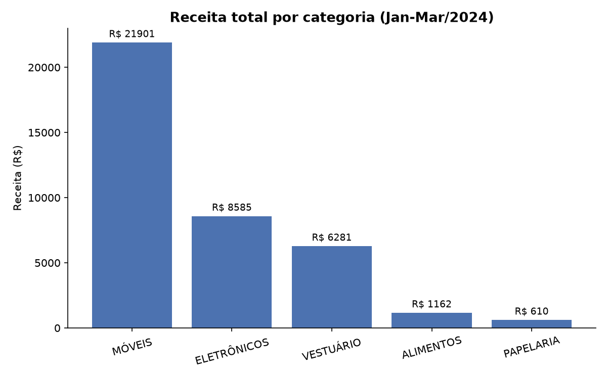

# 📊 Projeto de ETL em arquivos CSV

Pipeline de **ETL (Extract, Transform, Load)** que consolida relatórios mensais de vendas em CSV, limpa e enriquece os dados com `pandas`, e carrega o resultado em um banco de dados **SQLite** via `SQLAlchemy` — pronto para consultas SQL, dashboards ou análises futuras.

## 🎯 Objetivo do projeto

Simular um cenário comum no dia a dia de dados: uma empresa recebe **relatórios de vendas mensais em CSV**, exportados por sistemas diferentes (ou por pessoas diferentes), cheios de pequenas inconsistências — nulos, duplicatas, texto com espaços/caixa variando, preços em formatos diferentes. Este projeto automatiza:

1. **Extract** — ler e unificar todos os arquivos de uma pasta;
2. **Transform** — limpar, padronizar e enriquecer os dados;
3. **Load** — persistir o resultado em um banco de dados relacional.

## 🛠️ Tecnologias Utilizadas

- [pandas](https://pandas.pydata.org/) — leitura, limpeza e transformação dos dados
- [SQLAlchemy](https://www.sqlalchemy.org/) — conexão e carga no banco SQLite
- [Matplotlib](https://matplotlib.org/) — visualização de apoio
