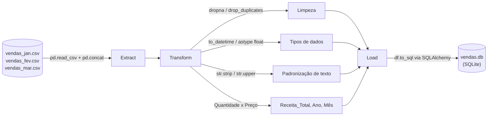

# 📊 ETL de Vendas com Pandas + SQLAlchemy

Pipeline de **ETL (Extract, Transform, Load)** que consolida relatórios mensais de vendas em CSV, limpa e enriquece os dados com `pandas`, e carrega o resultado em um banco de dados **SQLite** via `SQLAlchemy` — pronto para consultas SQL, dashboards ou análises futuras.


---

## 🎯 Objetivo do projeto

Simular um cenário comum no dia a dia de dados: uma empresa recebe **relatórios de vendas mensais em CSV**, exportados por sistemas diferentes (ou por pessoas diferentes), cheios de pequenas inconsistências — nulos, duplicatas, texto com espaços/caixa variando, preços em formatos diferentes. Este projeto automatiza:

1. **Extract** — ler e unificar todos os arquivos de uma pasta;
2. **Transform** — limpar, padronizar e enriquecer os dados;
3. **Load** — persistir o resultado em um banco de dados relacional.

> 📌 Os dados usados aqui são **sintéticos**, gerados propositalmente com problemas reais de qualidade (veja [`gerar_dados_exemplo.py`](gerar_dados_exemplo.py)), no formato inspirado no dataset público [Superstore Sales (Kaggle)](https://www.kaggle.com/datasets/vivek468/superstore-dataset-final). Isso deixa o repositório 100% reprodutível sem depender de download externo — mas o pipeline funciona da mesma forma com o CSV real do Kaggle (veja a seção [Usando o dataset real do Kaggle](#-usando-o-dataset-real-do-kaggle)).

---

## 🗂️ Estrutura do projeto

```
etl-vendas-pandas/
├── data/
│   ├── vendas_jan.csv        # dados brutos de janeiro
│   ├── vendas_fev.csv        # dados brutos de fevereiro
│   └── vendas_mar.csv        # dados brutos de março
├── assets/
│   └── receita_por_categoria.png   # gráfico gerado pelo pipeline
├── gerar_dados_exemplo.py    # cria os CSVs de exemplo (dados sintéticos)
├── etl.py                    # pipeline ETL principal (Extract, Transform, Load)
├── vendas.db                 # banco SQLite gerado (criado ao rodar etl.py)
├── requirements.txt
├── .gitignore
├── LICENSE
└── README.md
```

## 🔄 Arquitetura do pipeline



---

## 🧩 Como cada etapa foi implementada

### 1) Extract — Extração

```python
arquivos_csv = sorted(glob.glob("data/vendas_*.csv"))
dataframes = [pd.read_csv(arq) for arq in arquivos_csv]
df_bruto = pd.concat(dataframes, ignore_index=True)
```

Todos os CSVs da pasta `data/` são lidos e empilhados em um único `DataFrame` com `pd.concat()`. Cada linha recebe também a coluna `arquivo_origem`, útil para rastrear de qual mês veio um registro problemático durante a depuração.

### 2) Transform — Transformação

**Limpeza de dados**

| Problema encontrado | Como foi resolvido |
|---|---|
| Linhas totalmente duplicadas | `df.drop_duplicates()` |
| `Quantidade` ou `Data` ausente | `df.dropna(subset=[...])` — poucos registros e sem forma segura de inferir o valor, então são removidos |
| `Preco_Unitario` ausente | Preenchido com a **mediana de preço da própria categoria** (`groupby().transform()`), mais robusta que a média porque não é distorcida por outliers |
| `Categoria` com espaços/caixa inconsistente (`" papelaria"`, `"PAPELARIA "`) | `.str.strip().str.upper()` |
| `Preco_Unitario` em formatos diferentes (`"R$ 8,08"`, `"33,90"`, `"94.13"`) | Função `_limpar_preco()` remove símbolo de moeda, espaços, e converte vírgula decimal para ponto antes do `float()` |
| `Data` como texto | `pd.to_datetime(..., errors="coerce")` |

> 💡 O código usa `dropna()` para `Quantidade`/`Data` mas **`fillna()` inteligente** (por categoria) para `Preco_Unitario` — uma decisão deliberada, explicada em comentário no próprio código, para mostrar que cada caso de dado ausente merece uma estratégia diferente, e não um `dropna()` genérico aplicado ao dataset inteiro.

**Novas features**

```python
df["Receita_Total"] = df["Quantidade"] * df["Preco_Unitario"]
df["Ano"] = df["Data"].dt.year
df["Mes"] = df["Data"].dt.month
```

### 3) Load — Carga

```python
engine = create_engine("sqlite:///vendas.db")
df.to_sql("vendas", con=engine, if_exists="replace", index=False)
```

O SQLite foi escolhido por ser **um único arquivo**, sem precisar subir servidor — ideal para portfólio e para rodar em qualquer máquina. Trocar para PostgreSQL/MySQL depois exige apenas mudar a *connection string* do `create_engine()`; o resto do pipeline não muda.

---

## ▶️ Como rodar o projeto

```bash
# 1. Clone o repositório
git clone https://github.com/SEU-USUARIO/etl-vendas-pandas.git
cd etl-vendas-pandas

# 2. Crie e ative um ambiente virtual (recomendado)
python -m venv .venv
source .venv/bin/activate      # Windows: .venv\Scripts\activate

# 3. Instale as dependências
pip install -r requirements.txt

# 4. (Opcional) gere novos dados de exemplo — o repositório já vem com os CSVs prontos
python gerar_dados_exemplo.py

# 5. Rode o pipeline
python etl.py
```

Ao final, você terá:
- `vendas.db` — banco SQLite com a tabela `vendas` já limpa e enriquecida;
- `assets/receita_por_categoria.png` — gráfico de receita por categoria.

### Exemplo de saída no terminal

```
[EXTRACT] 3 arquivo(s) encontrado(s):
  - vendas_fev.csv: 19 linhas
  - vendas_jan.csv: 22 linhas
  - vendas_mar.csv: 15 linhas
[EXTRACT] Total consolidado: 56 linhas

[TRANSFORM] Duplicatas exatas removidas: 3
[TRANSFORM] Linhas removidas por Quantidade/Data ausente: 3
[TRANSFORM] Total de linhas após transformação: 50

[LOAD] 50 linhas gravadas na tabela 'vendas' de 'vendas.db'
[LOAD] Verificação pós-carga: 50 linhas na tabela

Pipeline ETL concluído com sucesso.
```

### Consultando o resultado

```python
import pandas as pd
from sqlalchemy import create_engine

engine = create_engine("sqlite:///vendas.db")
df = pd.read_sql("SELECT * FROM vendas ORDER BY Receita_Total DESC LIMIT 10", engine)
print(df)
```

Ou direto no terminal, com o cliente `sqlite3`:

```bash
sqlite3 vendas.db "SELECT Categoria, SUM(Receita_Total) FROM vendas GROUP BY Categoria;"
```

---

## 📈 Usando o dataset real do Kaggle

Quer usar o **Superstore Sales** de verdade em vez dos dados sintéticos?

1. Baixe o CSV em [kaggle.com/datasets/vivek468/superstore-dataset-final](https://www.kaggle.com/datasets/vivek468/superstore-dataset-final);
2. Renomeie/mapeie as colunas do arquivo para bater com o que o pipeline espera:

   | Coluna no `etl.py` | Coluna equivalente no Superstore |
   |---|---|
   | `Data` | `Order Date` |
   | `Categoria` | `Category` |
   | `Quantidade` | `Quantity` |
   | `Preco_Unitario` | `Sales` / `Quantity` (ou uma coluna de preço unitário, se houver) |

3. Salve o arquivo em `data/` com o nome `vendas_<algo>.csv`;
4. Rode `python etl.py` normalmente.

---

## 🚀 Possíveis evoluções

- [ ] Orquestrar as execuções com **Airflow** ou **Prefect**
- [ ] Trocar o SQLite por **PostgreSQL** (bastaria mudar a connection string)
- [ ] Adicionar testes automatizados com **pytest** para as funções de limpeza
- [ ] Criar um dashboard com **Streamlit** consumindo o `vendas.db`
- [ ] Validar o schema dos dados de entrada com **Pandera** ou **Great Expectations**

---

## 🛠️ Tecnologias

- [pandas](https://pandas.pydata.org/) — leitura, limpeza e transformação dos dados
- [SQLAlchemy](https://www.sqlalchemy.org/) — conexão e carga no banco SQLite
- [Matplotlib](https://matplotlib.org/) — visualização de apoio

---

## 👤 Autor

Projeto desenvolvido por **[Seu Nome]** como parte de portfólio em Engenharia/Análise de Dados.

- LinkedIn: [linkedin.com/in/seu-usuario](https://linkedin.com/in/seu-usuario)
- GitHub: [github.com/seu-usuario](https://github.com/seu-usuario)

## 📄 Licença

Este projeto está sob a licença MIT — veja [LICENSE](LICENSE) para mais detalhes.
